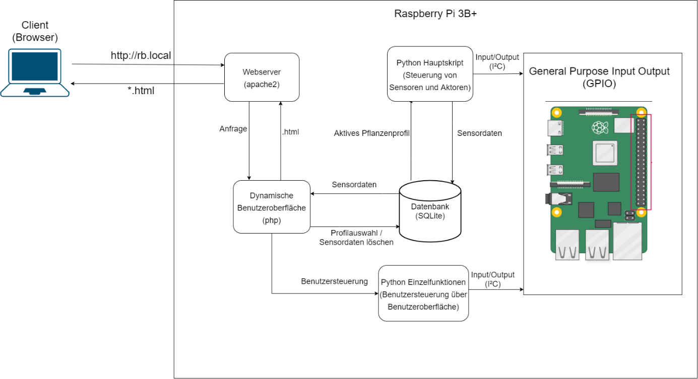
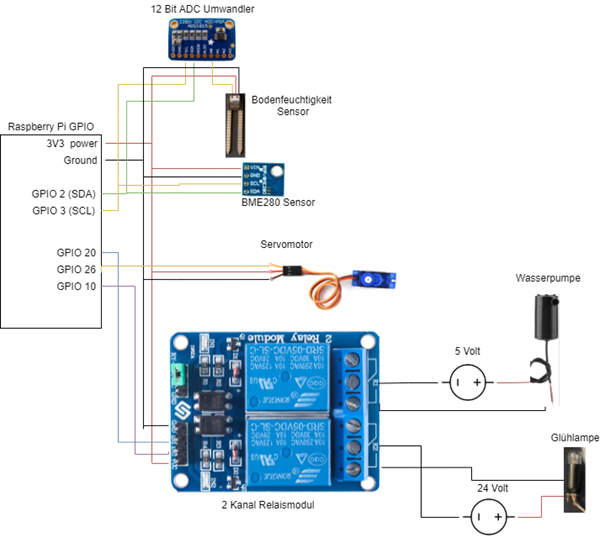
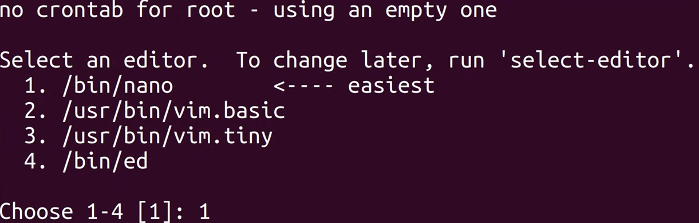
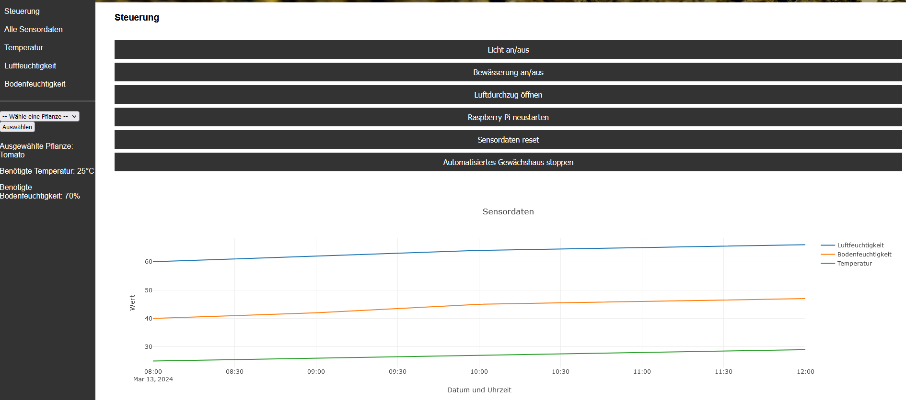

## Übersicht

Willkommen zu unserem Automatisierten Gewächshausprojekt! Das Ziel dieser Zusammenarbeit von Jan Klein und Velimir Kleymenov ist es, eine automatisierte Lösung für das Gewächshausmanagement bereitzustellen. Für dieses Projekt verwenden wir einen Raspberry Pi 3B+. Es wurde eine SQLite-Datenbank erstellt, in der die Pflanzendaten und Sensordaten gespeichert werden. Die Steuerung der Aktoren und Sensoren erfolgt über die GPIO-Pins mit Python und wird anschließend in einer Datenbank gespeichert. Die GUI wurde mit HTML und CSS erstellt. Die Ausgabe der Sensordaten in die GUI wurde mittels PHP umgesetzt und das Darstellen in einem Diagramm mit der Open-Source-Software Plotly.



## Inhaltsverzeichnis

- [Features](#features)
- [Hardware-Anforderungen](#hardware-anforderungen)
- [Setup](#setup)
- [Verwendung](#verwendung)
- [Lizenz](#lizenz)

## Features

- **Pflanzenauswahl:** Es stehen verschiedene Pflanzen zur Auswahl.
- **Automatische Steuerung je nach Pflanzenwahl:** Durch die Steuerung der Aktoren und Sensoren werden die benötigten Temperatur-, Wasser- und Bodenfeuchtigkeitsbedürfnisse der ausgewählten Pflanze automatisch angepasst.
- **Speicherung der Sensordaten:** In unserer Datenbank werden alle wichtigen Informationen über die Pflanzen und die Sensorausgabe gespeichert.
- **Ausgabe der aktuellen Sensordaten:** In unserer GUI werden die Sensordaten aus der Datenbank abgefragt und in einem Diagramm dargestellt.
- **Manuelle Steuerung möglich:** In unserer GUI können Sie auch den Raspberry Pi sowie Aktoren und Sensoren bei Bedarf manuell steuern.

## Hardware-Anforderungen

Um mit dem Projekt zu beginnen, stellen Sie sicher, dass Sie über die folgenden Hardwarekomponenten verfügen:

- Raspberry Pi 3B+
- RPI-Netzteil
- Netzwerkkabel
- Leitungen
- Wasserschlauch
- 2 Relais
- 12-Bit-ADC-Umwandler
- Benötigte Aktoren:
  - Mini-Wasserpumpe
  - 180° Servomotor
  - Glühlampe
- Benötigte Sensoren:
  - BME280
  - Bodenfeuchtigkeitssensor

Bitte beachten Sie, dass die Verwendung anderer Hardwarekomponenten zu unerwarteten Fehlern führen kann und die Funktionalität des Projekts beeinträchtigen könnte.

## Setup

1. **Wir verwenden das Betriebssystem Debian GNU/Linux 11 (bullseye) auf unserem Raspberry Pi 3B+.**

### Benötigte Software

Die unten genannte Software wird benötigt, um unser Programm nutzen zu können. Die Befehle für die Installation für unser verwendetes Betriebssystem sind separat aufgelistet.

- Git

    ```bash
    sudo apt install git
    ```

- Python

    ```bash
    sudo apt install python3 python3-venv python3-pip
    ```

- Smbus2

    ```bash
    pip3 install smbus2
    ```

- RPi.bme280

    ```bash
    pip3 install RPi.bme280
    ```

- gpiozero

    ```bash
    pip install gpiozero
    ```

- ADS1015 (siehe [hier](https://learn.adafruit.com/raspberry-pi-analog-to-digital-converters/ads1015-slash-ads1115))

    ```bash
    git clone https://github.com/adafruit/Adafruit_Python_ADS1x15.git
    cd Adafruit_Python_ADS1x15
    sudo python setup.py install
    ```

- SQLite3

    ```bash
    sudo apt-get install sqlite3
    ```

- Plotly

    ```bash
    pip install plotly==5.19.0
    ```

- PHP

    ```bash
    sudo apt-get install php
    ```

- Node.js

    ```bash
    sudo apt install nodejs
    ```

- Apache2

    ```bash
    sudo apt install apache2
    ```

3. **Schließe Aktoren und Sensoren an die Raspberry Pi GPIO-Pins an**


4. Klone das Repository auf deinen Raspberry Pi:

   ```bash
   git clone https://github.com/jankln/Automatisiertes_Gewaechshaus.git
   ```

5. **Füge main.py und index.php zum Autostart hinzu:**

    ```bash
    sudo crontab -e
    ```

6. **Wähle einen Editor, in unserem Beispiel nano**


7. **Gehe nach unten in der Datei und füge folgenden Command ein:**
    ```bash
    @reboot python3 /home/pi/Automatisiertes_Gewaechshaus/main.py
    
    ```
8. **Führe die SQL Datei aus:**
    ```bash
    cd Automatisiertes_Gewaechshaus
    sqlite3 AutoGrowing.db
    .read create.sql
    ```

## Verwendung

- **Navigationsbar:** Oben links befindet sich die Navigationsbar um sich schneller vortzubewegen.
- **Auswahl Pflanze:** Es gibt links ein Dropdown Menü, indem man seine aktuelle Pflanze auswählen kann. Beim betätigen des Auswählen Buttons, wird diese Ausgewählt.
- **Ausgewählte Pflanze:** Die ausgewählte Pflanze wird unterhalb des Auswählen Buttons angezeigt.
- **Manuelle Steuerung:** Mit den beschrifteten Buttons kann man, wenn benötigt die Aktoren und den Raspberry Pi manuell steuern.
- **Diagramm Sensorwerte:** Unterhalb des Auswahl Buttons sieht man die aktuell ausgewählte Pflanze mit deren Anforderungen. Durch drücken der linken Maustaste kann man den gewünschten Bereich genauer anschauen und durch Doppelklick gelangt man wieder zur Ausgangsposition. Beim rübergleiten der Maus erscheint ein Menü mit weiteren anzeige Möglichkeiten.


## Lizenz

Dieses Projekt ist unter der [MIT License](LICENSE). Fühlen Sie sich frei, den Code gemäß den Bedingungen der Lizenz zu verwenden, zu ändern und zu verbreiten.